# Hi, I'm Zhelyazko 👋

**.NET & IoT Developer** based in Burgas, Bulgaria.

I build web applications, APIs, IoT platforms, and self-hosted services using the Microsoft .NET ecosystem.

My main focus is on:

- Blazor and ASP.NET Core applications
- ESP32 devices with .NET nanoFramework
- MQTT-based telemetry and device control
- PostgreSQL, Entity Framework Core, and Redis
- Dockerized deployments on Linux VPS infrastructure

## 🛠️ Core Stack

## 🚀 Current Focus

- Building a Blazor-based IoT weather and device monitoring platform
- Developing ESP32 firmware with .NET nanoFramework and MQTT
- Building and operating self-hosted .NET services
- Working on an IRC server and services platform written in .NET
- Improving deployment, monitoring, and security automation

## 📊 GitHub Activity

  
  

> Language statistics represent repository code distribution, not proficiency.

## 🤝 Contact

---

Open to collaboration on .NET, Blazor, IoT, and self-hosted software projects.
